<!--
  Счётчики PR не хардкодить. Карточки в assets/cards/ обновляет workflow update-cards.yml.
  Только vue-dark: пара light/dark через #gh-*-mode-only на GitHub auto-theme даёт белую карточку на тёмном профиле.
-->

# Ivan Bochkarev

**Frontend · Vue 3 / Nuxt · MODX**

Веб-приложения, extras и документация.
Контрибьютор Vue, Nuxt и экосистемы MODX.

[ibochkarev.ru](https://ibochkarev.ru)
·
[Telegram](https://t.me/ibochkarev)
·
[Email](mailto:ivanx86@gmail.com)
·
[X](https://x.com/Bochkarev_Ivan)

## Чем занимаюсь

- Интерфейсы на **Vue 3** и **Nuxt**: Pinia, PrimeVue, Vite, TypeScript.
- Extras и документация для **MODX 3**: магазин, редакторы, картинки, антиспам.
- Русские переводы документации **Vue** и **Nuxt**.

Живу в Омске. По проектам можно писать в Telegram или на почту.

## Open source

  

### Vue и Nuxt

| Репозиторий | Вклад |
| --- | --- |
| [nuxt/nuxt](https://github.com/nuxt/nuxt) | Документация, API, DX · [мои PR](https://github.com/nuxt/nuxt/pulls?q=is%3Apr+author%3AIbochkarev) |
| [translation-gang/nuxt](https://github.com/translation-gang/nuxt) | Русский перевод документации Nuxt · [мои PR](https://github.com/translation-gang/nuxt/pulls?q=is%3Apr+author%3AIbochkarev) |
| [vuejs-translations/docs-ru](https://github.com/vuejs-translations/docs-ru) | Перевод документации Vue 3 · [мои PR](https://github.com/vuejs-translations/docs-ru/pulls?q=is%3Apr+author%3AIbochkarev) |
| [translation-gang/nuxt.com](https://github.com/translation-gang/nuxt.com) | Русская версия сайта Nuxt · [сайт](https://nuxt-ru.vercel.app) · [мои PR](https://github.com/translation-gang/nuxt.com/pulls?q=is%3Apr+author%3AIbochkarev) |

### MODX

Участник [modx-pro](https://github.com/modx-pro). Пишу extras, правки ядра и документацию.

[modxcms/revolution](https://github.com/modxcms/revolution)
·
[MiniShop3](https://github.com/modx-pro/MiniShop3)
·
[Docs](https://github.com/modx-pro/Docs)
·
[Tickets](https://github.com/modx-pro/Tickets)
·
[vueTools](https://github.com/modx-pro/vueTools)

[PR в modx-pro](https://github.com/search?q=author%3AIbochkarev+type%3Apr+is%3Amerged+org%3Amodx-pro&type=pullrequests)
·
[PR в modxcms](https://github.com/search?q=author%3AIbochkarev+type%3Apr+is%3Amerged+org%3Amodxcms&type=pullrequests)

## Проекты

  
  
  
  

Ещё extras: [CrawlerDetect](https://github.com/Ibochkarev/CrawlerDetect) (боты и формы без CAPTCHA), [Reactions](https://github.com/Ibochkarev/Reactions) (реакции для MODX 3).

## Стек

| Слой | Инструменты |
| --- | --- |
| Frontend | Vue 3, Nuxt, TypeScript, Pinia, PrimeVue, Vite, VitePress |
| Backend | PHP, MODX, MySQL, Composer |
| UI | Tailwind, Sass, Figma |

## Активность

  

